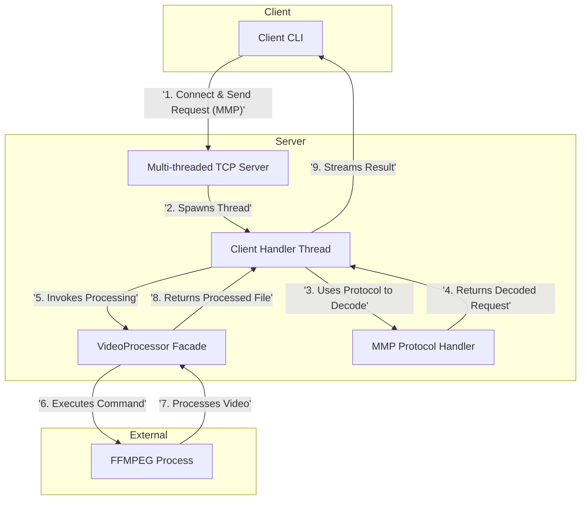

# Video Compressor Service

## 概要

Video Compressor Serviceは、動画ファイルに対する様々な処理を行う、高機能なクライアント/サーバーシステムです。クライアントは動画ファイルをアップロードし、圧縮、リサイズ、音声抽出などの処理をサーバーに依頼し、処理済みのファイルを受け取ることができます。

通信にはカスタム設計のアプリケーションレベルプロトコル(MMP)を使用し、外部ツールであるFFMPEGをPythonから呼び出して、実際の動画処理を実行します。

## 特徴

-   **多機能な動画処理**: FFMPEGを利用し、以下の機能を提供します。
    -   動画の圧縮
    -   解像度の変更
    -   アスペクト比の変更
    -   音声抽出（MP3形式）
    -   指定時間でのクリップ作成（GIF/WEBM）
-   **カスタムプロトコル(MMP)**: JSON形式のオプションとバイナリペイロードを組み合わせた、柔軟で拡張性の高いカスタム通信プロトコルを設計・実装。
-   **リソース管理**:
    -   IPアドレスに基づき、同時に1つの処理のみを許可することで、サーバーリソースの独占を防止。
    -   処理完了後、アップロードされた元ファイルと処理済みファイルを自動的に削除し、ディスクスペースをクリーンに保つ。
-   **堅牢なアーキテクチャ**:
    -   マルチスレッド対応のTCPサーバー。
    -   詳細なJSON形式のエラー報告機能。
    -   依存性の注入(DI)を用いた、疎結合でメンテナンス性の高いコンポーネント設計。

## このプロジェクトを通して学べること・習得できること

### 1. ソフトウェア設計・アーキテクチャ
-   **クラス設計と責任分担**: 単一責任の原則(SRP)に基づいたコンポーネント設計。
-   **レイヤードアーキテクチャ**: プレゼンテーション、ビジネスロジック、データの各層の分離。
-   **デザインパターン**: ファサードパターン(VideoProcessor)、依存性の注入(DI)。

### 2. ネットワークプログラミング
-   **TCPソケットプログラミング**: クライアント/サーバー間の安定した通信。
-   **カスタムプロトコル設計**: ヘッダーとボディ（JSON + バイナリ）を組み合わせた独自の通信規約の設計と実装。
-   **エラーハンドリング**: ネットワーク切断やプロトコル違反への堅牢な対応。

### 3. コンカレントプログラミング
-   **マルチスレッドサーバー**: `threading`モジュールによる複数クライアントの同時接続処理。
-   **リソース競合の管理**: `threading.Lock`を用いた、共有リソース（アクティブ接続リスト）への安全なアクセス制御。

### 4. 外部プロセス連携
-   **`subprocess`モジュールの活用**: PythonプログラムからFFMPEGのような外部コマンドラインツールを安全に呼び出し、その実行結果（標準出力、エラー）を管理する。

### 5. Pythonプログラミング実践
-   **型ヒント(Type Hints)**: コードの可読性と静的解析の精度を向上。
-   **構造化例外処理**: `try/except/finally`による、エラーハンドリングとリソースクリーンアップの徹底。
-   **バイナリデータ操作**: `struct`モジュールによる、固定長バイナリヘッダーのパックとアンパック。

## アーキテクチャ

このプロジェクトのアーキテクチャは、`diagrams`フォルダ内にPlantUML形式で記述されています。
各図は、システムの異なる側面を視覚化しています。

-   `usecase.pu`: ユーザーとシステムのインタラクション
-   `activity.pu`: システム全体のワークフロー
-   `sequence.pu`: オブジェクト間の詳細な相互作用
-   `class.pu`: クラスとその関連性
-   `component.pu`: システムを構成する主要コンポーネント

これらのファイルは、[PlantUMLをサポートするビューア](https://plantuml.com/viewers)やVS Codeの拡張機能などで表示できます。
基本的なアーキテクチャは以下の通りです。


## 必要条件
-   Python 3.7以上
-   FFMPEG
    -   システムの`PATH`に`ffmpeg`コマンドが含まれている必要があります。

## インストールとセットアップ
1.  リポジトリをクローンします。
    ```bash
    git clone https://github.com/yourusername/VideoCompressorService.git
    cd VideoCompressorService
    ```
2.  FFMPEGをインストールします。
    -   **macOS (Homebrew)**: `brew install ffmpeg`
    -   **Ubuntu/Debian**: `sudo apt update && sudo apt install ffmpeg`
    -   **Windows**: [公式サイト](https://ffmpeg.org/download.html)からダウンロードし、実行ファイルのあるディレクトリに`PATH`を通してください。

## 使用方法

### サーバーの起動
プロジェクトのルートディレクトリから、以下のコマンドを実行します。
```bash
python src/main.py
```
サーバーが`localhost`のポート`5000`で待機を開始します。

### クライアントの実行
クライアントの実行には、`src/client/CLI.py`を直接実行します。引数として、処理したい動画ファイルのパスと、JSON形式のオプションを渡します。

**例1: 動画を圧縮する**
```bash
python src/client/CLI.py path/to/your/video.mp4 '{"operation": "compress"}'
```

**例2: 解像度を 1280x720 に変更する**
```bash
python src/client/CLI.py path/to/your/video.mp4 '{"operation": "resize", "width": 1280, "height": 720}'
```

**例3: 10秒から15秒の範囲でGIFを作成する**
```bash
python src/client/CLI.py path/to/your/video.mp4 '{"operation": "create_clip", "start_time": "00:00:10", "end_time": "00:00:15", "format": "gif"}'
```

成功すると、処理済みのファイルが`downloads`フォルダに保存されます。

## ライセンス
This project is licensed under the MIT License.