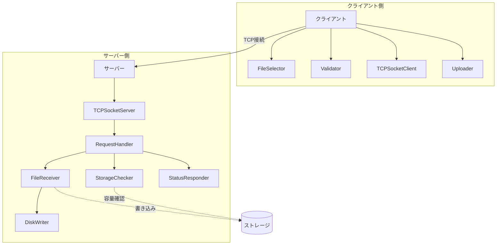

# VideoCompressorService

## 概要

VideoCompressorServiceは、ビデオファイルのアップロード機能を提供するクライアント/サーバーシステムです。クライアントがMP4ファイルをアップロードすると、サーバーでストレージ容量をチェックし、ファイルを保存します。将来的には圧縮処理の機能も追加予定です。

## 特徴

- クライアント/サーバーアーキテクチャに基づく設計
- MP4形式のビデオファイルのアップロードとストレージ管理
- シンプルなTCPソケット通信によるデータ転送
- 効率的なチャンク方式のファイル転送
- ストレージ容量の監視と管理
- コマンドラインインターフェース（CLI）による操作性

## このプロジェクトを通して学べること・習得できること

### 1. ソフトウェア設計・アーキテクチャ
- **クラス設計と責任分担**: 単一責任の原則(SRP)に基づいたクラス設計
- **レイヤードアーキテクチャ**: プレゼンテーション層、ビジネスロジック層、データ層の分離
- **デザインパターン**:
  - コマンドパターン（CLI操作）
  - ファサードパターン（複雑な処理の隠蔽）
  - 依存性注入（コンポーネント間の結合度低減）

### 2. ネットワークプログラミング
- **TCPソケットプログラミング**: クライアント/サーバー間の通信
- **バイナリプロトコル設計**: ヘッダーとペイロードの構造化
- **チャンク転送**: 大きなファイルの効率的な転送方法
- **エラーハンドリング**: ネットワーク接続の問題や切断への対応

### 3. コンカレントプログラミング
- **マルチクライアント対応**: 同時接続の処理
- **リソース競合の管理**: 共有リソースへのアクセス制御
- **シグナルハンドリング**: 適切なシャットダウン処理

### 4. ファイル処理とI/O操作
- **バイナリファイルの取り扱い**: 読み込みと書き込み
- **ストリーム処理**: 効率的なデータ処理
- **ディスクI/O最適化**: パフォーマンス向上テクニック

### 5. Pythonプログラミング実践
- **型ヒント(Type Hints)**: 可読性と保守性の向上
- **構造化例外処理**: try/except/finallyブロックの適切な使用
- **コンテキストマネージャー**: withステートメントによるリソース管理
- **バイナリデータ操作**: struct、bytearrayモジュールの活用

### 6. ログとデバッグ
- **構造化ログ**: ログレベルと形式の標準化
- **デバッグ技術**: 問題特定とトラブルシューティング
- **テスト戦略**: 単体テストと統合テスト

### 7. ユーザーインターフェース設計
- **コマンドラインインターフェース**: ユーザーフレンドリーなCLI設計
- **エラーメッセージ**: 明確で実用的なエラー通知

### システムアーキテクチャ図



## 必要条件
- Python3.7以上
- ネットワーク接続(ローカルネットワークでも可)

## インストール手順
1. リポジトリをクローン
```
git clone https://github.com/yourusername/VideoCompressorService.git
cd VideoCompressorService
```
2. ディレクトリ構造を確認

```
VideoCompressorService/
├── src/
│   ├── client/
│   │   ├── __init__.py
│   │   ├── cli.py
│   │   ├── FileSelector.py
│   │   ├── TCPSocketClient.py
│   │   ├── Uploader.py
│   │   └── Validator.py
│   └── server/
│       ├── __init__.py
│       ├── Server.py
│       ├── DiskWriter.py
│       ├── FileReceiver.py
│       ├── RequestHandler.py
│       ├── StatusResponder.py
│       ├── StorageChecker.py
│       └── TCPSocketServer.py
├── uploads/  # アップロードされたファイルの保存先
└── README.md
```
## 使用方法

### サーバー起動
```
# 基本的な起動（デフォルトポート5000）
python -m src.server.Server

# ポートとストレージディレクトリを指定して起動
python -m src.server.Server 8080 /path/to/storage
```
## クライアント実行
```
# デフォルト設定（localhost:5000に接続）
python -m src.client.cli

# サーバーホストとポートを指定
python -m src.client.cli example.com 8080
```

## 機能一覧
- ファイル選択：ローカルファイルシステムからMP4ファイルを選択
- ファイル検証：選択されたファイルのフォーマット（MP4）とサイズ（最大100MB）を検証
- ファイルアップロード：TCPソケット接続を使用してサーバーにファイルを送信
- ストレージ管理：サーバーでのストレージ容量チェックと管理（最大4TB）
- ステータス通知：クライアントへの処理結果通知
## 技術スタック
- 言語: Python 3.7+
- ネットワーク: TCPソケットプログラミング
- ファイル処理: バイナリデータ処理、構造化データ（struct）
- ログ: Python標準ロギング
- インターフェース: コマンドラインインターフェース（CLI）

## 貢献方法
- Fork this repository
- Create a new branch (git checkout -b feature/your-feature)
- Make your changes
- Commit your changes (git commit -m 'Add some feature')
- Push to the branch (git push origin feature/your-feature)
- Open a Pull Request
## ライセンス
- MIT License

## 将来の拡張計画
- ファイル圧縮機能の追加
- マルチスレッド処理によるパフォーマンス向上
- ユーザー認証の実装
- WebインターフェースによるGUIクライアントの開発
- 圧縮進捗のリアルタイム表示機能